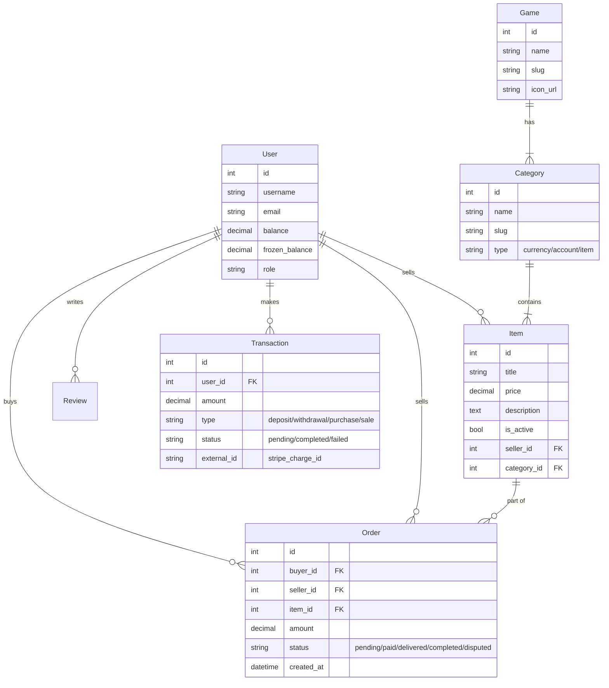

# Database Schema Design

This document outlines the table structure for the PostgreSQL database.

## ER Diagram (Textual)

## Detailed Table Definitions

### 1. Users App (`core`)
*   **CustomUser**
    *   Inherits from `AbstractUser`.
    *   `balance`: Decimal(10, 2) - default 0.00.
    *   `avatar`: ImageField.
    *   `is_seller`: Boolean - default False.

### 2. Wallet App (`wallet`) - **New**
*   **Transaction**
    *   `user`: ForeignKey(User).
    *   `amount`: DecimalField.
    *   `transaction_type`: CharField (DEPOSIT, WITHDRAWAL, PURCHASE, SALE, REFUND).
    *   `status`: CharField (PENDING, COMPLETED, FAILED).
    *   `stripe_payment_intent_id`: CharField (Store external ID for reference).
    *   `created_at`: DateTime.

### 3. Market App (`market`)
*   **Game**
    *   `name`: CharField (e.g., "Dota 2").
    *   `slug`: SlugField (unique).
    *   `image`: ImageField.

*   **Category**
    *   `game`: ForeignKey(Game).
    *   `name`: CharField (e.g., "Skins").
    *   `slug`: SlugField.

*   **Item**
    *   `seller`: ForeignKey(User).
    *   `category`: ForeignKey(Category).
    *   `title`: CharField.
    *   `price`: DecimalField.
    *   `description`: TextField.
    *   `image`: ImageField.
    *   `status`: CharField (choices: ACTIVE, SOLD, INACTIVE).
    *   `created_at`: DateTime.

*   **Order**
    *   `buyer`: ForeignKey(User, related_name='buy_orders').
    *   `seller`: ForeignKey(User, related_name='sell_orders').
    *   `item`: ForeignKey(Item).
    *   `price`: DecimalField (snapshot of item price at purchase time).
    *   `status`: CharField (choices: CREATED, PAID, SHIPPED, COMPLETED, CANCELLED, DISPUTED).
    *   `created_at`: DateTime.
    *   `updated_at`: DateTime.
